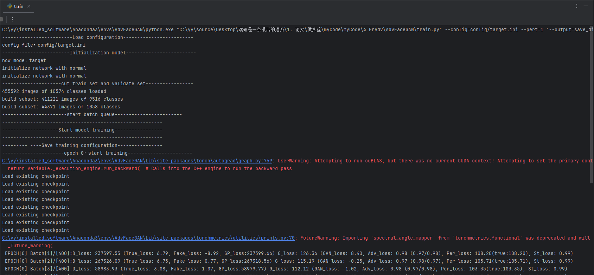
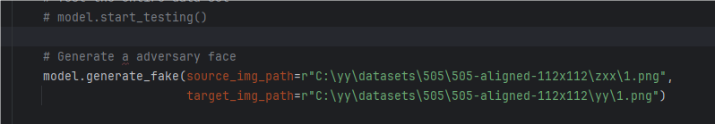
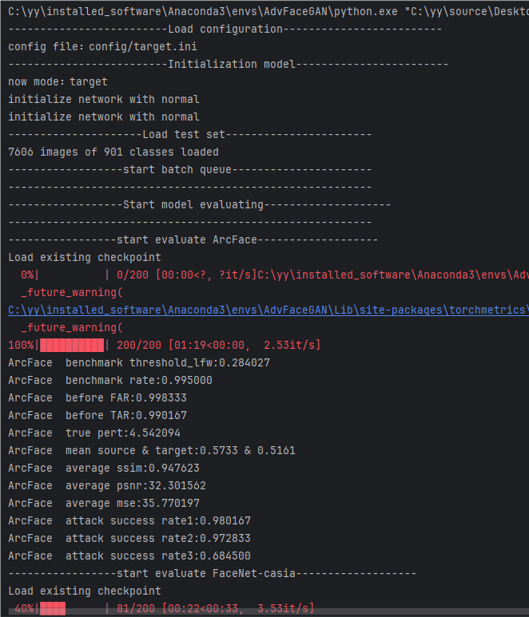

# AdvFaceGAN

此项目是论文相关联的代码，训练GAN生成对抗人脸来攻击人脸识别模型，在离线模型和商业人脸比对api（腾讯云、阿里云和face++）上都取得了很好的攻击效果。目前正在审查提交给peerj期刊。

## 1. 环境准备

建议使用PyCharm IDE，并在cmd而非powershell下执行以下指令配置conda环境（请确保您的计算机已安装conda）：

首先国内用户建议conda换源增加下载速度：

```shell
conda config --add channels https://mirrors.tuna.tsinghua.edu.cn/anaconda/pkgs/main
conda config --add channels https://mirrors.tuna.tsinghua.edu.cn/anaconda/pkgs/free
conda config --add channels https://mirrors.tuna.tsinghua.edu.cn/anaconda/pkgs/r
conda config --add channels https://mirrors.tuna.tsinghua.edu.cn/anaconda/pkgs/pro
conda config --add channels https://mirrors.tuna.tsinghua.edu.cn/anaconda/pkgs/msys2
```

以下指令安装conda环境frb，被用于在"1_prepDataset"中预处理原始数据集（例如[casia-webface](https://www.kaggle.com/datasets/ntl0601/casia-webface)or[lfw](http://vis-www.cs.umass.edu/lfw/lfw.tgz)）。当然我们更建议您使用我们在"2. 下载你需要的一切"中提供的预处理后的数据集，或者安装frb环境并预处理原始数据集（建议使用Win10操作系统，因为你可能无法在Linux下安装tensorflow-gpu 2.6 ！！！)：

```shell
conda deactivate
conda remove -n frb --all -y
conda create -n frb -y
conda activate frb
conda install tensorflow-gpu=2.6.0 -y
conda install numpy==1.23.4 -y
conda install pytorch torchvision torchaudio pytorch-cuda=12.1 -c pytorch -c nvidia -y
conda install -c conda-forge opencv -y
conda install matplotlib -y
conda install tqdm -y
conda install scikit-learn -y
conda install scikit-image -y
conda install --channel https://conda.anaconda.org/zhaofeng-shu33 easydict -y
conda install imageio -y
conda install ipykernel -y
python -m ipykernel install --user --name=frb --display-name "frb"
```

以下指令安装conda环境AdvFaceGAN，被用于训练和测试你的模型：

```shell
conda deactivate
conda remove -n AdvFaceGAN --all -y
conda create -n AdvFaceGAN -y
conda activate AdvFaceGAN
conda install pytorch torchvision torchaudio pytorch-cuda=12.1 -c pytorch -c nvidia -y
conda install torchmetrics tqdm tensorboard multiprocess  -y
conda install -c conda-forge jupyter -y
conda install matplotlib -y
conda install ipykernel -y
python -m ipykernel install --user --name=AdvFaceGAN --display-name "AdvFaceGAN"

pip install alibabacloud_facebody20191230
pip install -i https://mirrors.tencent.com/pypi/simple/ --upgrade tencentcloud-sdk-python
```

## 2. 下载你需要的一切

您可以从以下链接下载我们预处理后的数据集：

预处理后的[casia-webface数据集](https://figshare.com/articles/dataset/casia-aligned-112x112/27073465?file=49308127)

预处理后的[lfw数据集](https://figshare.com/articles/dataset/lfw-aligned-112x112/27073438)

首先是训练中需要的白盒替代模型：[ckpts](https://drive.google.com/file/d/1cuE0a5p5pUJJuNXeAdL4jcWYRJZagg8x/view?usp=drive_link)，请下载并解压到"./fr_models/ckpt/"目录。

Then is the pretrained models that the authors themselves trained using the code of this project, which can be used directly for testing：[pretrained_models.zip](https://drive.google.com/file/d/1nhuSNXR30tYiDCdSeFtG0gXjt796deRM/view?usp=drive_link)，This is required to test the pretrained model directly, so download and unzip them to "./save_dir/".
然后是作者自己使用本项目代码训练的预训练模型，可以直接用于测试：[pretrained_models.zip](https://drive.google.com/file/d/1nhuSNXR30tYiDCdSeFtG0gXjt796deRM/view?usp=drive_link)，请下载并解压到"./save_dir/"目录。

我们还友好地公开了一些对比方法的对抗样本[AdvSamples]（https://drive.google.com/file/d/1WFmcrTjmbbKc98lC25CP7NImwlyyiBFV/view?usp=drive_link)，如AT3D、 SiblingAttack、AdvMakeUP、AdvFaces等。您可以下载并解压到"./data/"，并使用7_compare_experiment.ipynb来对比他们的指标。

## 3. 开始新的训练

在项目根目录打开命令行，执行以下脚本调用train.py开始新的训练过程，但不要忘记在配置文件中更正数据集目录！（本项目的配置策略是从配置文件中读取默认配置，并允许使用命令行参数调整核心训练参数，您可以从train.py的main函数中找到这些参数的含义）

```
python train.py --config="configuration file path" --tms=["white-box models used to training",] --pert=upperlimit of pertubation --output="save dir" --stlossfactor=stloss's factor --maxssim=upperlimit of ssim

# 比如：
# 训练目标  默认配置 扰动上限为4 & 无结构损失 & 无原始身份损失：
python train.py --config="config/target.ini" --pert=4 --output="./save_dir/target 4 无结构损失 无原始身份损失" --stlossfactor=0 --sourceadvlossfactor=0

```

正确启动训练后，将显示如下进度：



## 4. 开始测试

Open the command line at the root of the project code, execute the following script to call train.py to start testing:
在项目根目录打开命令行，执行以下脚本调用test.py开始新的测试过程：

```
python test.py --config="configuration file path" --model_path="directory of model's pth file" --epoch=target epoch

# 比如：
# 测试 "./save_dir/target 4 8白盒 无stloss/model"中的第990轮训练结果：
python test.py --config="config/target.ini" --model_path="./save_dir/target 4 8白盒 无stloss/model" --epoch=990
# 测试 "./save_dir/target 5 8白盒 奇怪ssim 92ssim 双身份损失0.15/model"中的第2490轮训练结果：
python test.py --config="config/target.ini" --model_path="./save_dir/target 5 8白盒 奇怪ssim 92ssim 双身份损失0.15/model" --epoch=2490
```

为了测试结果模型，可以通过修改test.py中以下位置的注释，在两种测试模式之间切换：



start_testing函数读取配置文件中的test_dataset_dir数据集，随机选取6000组非人脸生成对抗人脸，测试test_model_name_list中的所有模型，并输出PSNR、MSE、SSIM、冒充攻击成功率等评价指标。下图中，冒充攻击前的ArcFace模型1-FAR为0.997833，冒充攻击后的ArcFace模型1-FAR为1-0.980333=0.019667。



generate_fake函数将生成具有source和target两者人脸特征的对抗人脸，并存储在项目根目录下的test文件夹中。

## 5. 评估商业人脸API

首先，在您的系统环境变量中配置阿里云、腾讯云或face++的API key和secret：

"ALIBABA_CLOUD_ACCESS_KEY_ID","ALIBABA_CLOUD_ACCESS_KEY_SECRET"

"FACEPP_API_KEY","FACEPP_API_SECRET"

"TENCENTCLOUD_SECRET_ID","TENCENTCLOUD_SECRET_KEY"

然后使用2_eval_aliyun.ipynb评估阿里云API， 3_eval_tencent.ipynb评估腾讯云API和4_eval_faceplusplus.ipynb评估face++ API。

或者，您也可以简单地使用"./test"中生成的示例，source.png是受害者人脸，target.png是攻击者人脸，fake.png是对抗人脸，它将被商业脸API判断为与受害者和攻击者都高度相似！

商业人脸API的试用链接如：[Aliyun](https://vision.aliyun.com/experience/detail?spm=a2cvz.27720474.J_9219321920.16.be705d53Ftk66m&tagName=facebody&children=CompareFace)  [Tencent](https://cloud.tencent.com/product/facerecognition)  [Face++](https://www.faceplusplus.com.cn/face-comparing/)

## 5. 有关对比实验

为了公平的对比测试，我们参考了2023 CVPR中发表的Sibling Attack和AT3D，根据其对比实验中使用的1000对攻击者和受害者，生成了1000张不同方法的对抗人脸，通过这些对抗人脸来评估各种对比方法的攻击性和隐蔽性。

同时，对比实验中涉及的各种SOTA攻击方法生成的对抗人脸可以在这里下载[AdvSamples](https://drive.google.com/file/d/1WFmcrTjmbbKc98lC25CP7NImwlyyiBFV/view?usp=drive_link)。并通过7_compare_experiment.ipynb复制论文中的对比实验结果。
